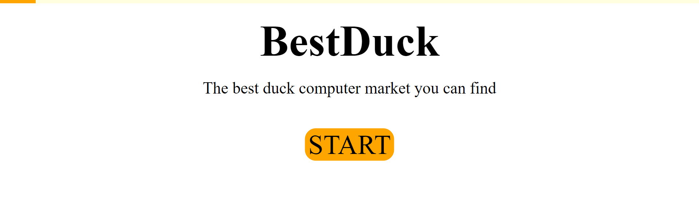
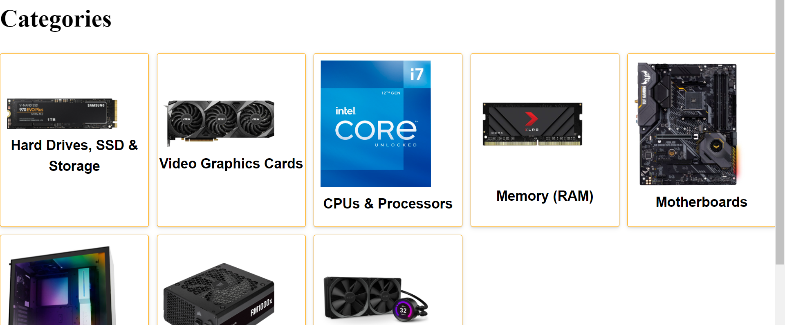
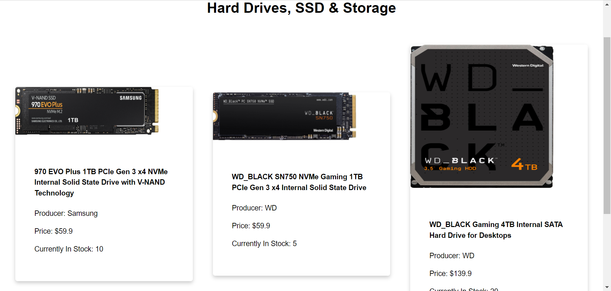
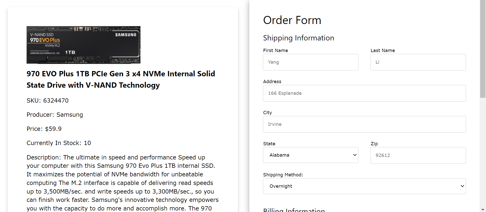

# Readme

## Group Members & Information

Yang Li

Shiyu Wang

Wentao Jiang

Github Repo: https://github.com/BruceWong12/UCI-CS137-Internet-Applications-Engineering

## Our E-Commerce Company

For two decades, **BestDuck** has been at the forefront of e-commerce. Founded in 2001, **BestDuck** began selling PC components and helped popularize the PC-building movement, and in doing so, developed a cult following among PC and DIY enthusiasts. Since then, **BestDuck** Inc. is the leading tech-focused e-retailer in North America, with a global reach in Europe, South America, Asia Pacific and the Middle East. **BestDuck** is headquartered in City of Irvine, California, with North American distribution facilities located throughout the United States and Canada.

## The Website

### Home Page

### Product Category

We have a two-level directory of products. The first directory is the category of the product;

- Each category links to a directory/category.

### Product Page

Under each category, we put several sample products.

### Order Page

The **product detail page** includes the order submission function.

Guest can fill the form and submit the information. 

The page will automatically check the validity and report improper value submission. If the all the value is proper, a email client will be brought up and the information will be filled in the body. 
